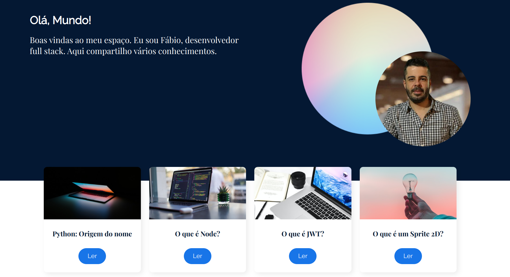

## Olá Mundo
Uma pagina web de compatilhamento dos meus conhecimentos. 
A ideia principal é iniciar um projeto React utilizando o Vite e para estudos do **React Router**, junto ao curso [React: desenvolvendo em React Router com JavaScript](https://cursos.alura.com.br/course/React-desenvolvendo-react-router-javaScript)

## 🔨 Funcionalidades do Projeto
Neste projeto foi desenvolvido a tela de inicio, sobre mim e cards dos artigos. Os cards contém titulo e o botão para ler o artigo.

## ✔️ Técnicas e Tecnologias Utilizadas
Durante esse curso utilizaremos:
* Figma
* JavaScript
* React
* React Router DOM
* React Markdown
* Vite Plugin Svgr
* CSS
* Componentização
* Props
  
## 🎨 Link do Figma
Para visualizar o Figma do projeto, clique [aqui](https://www.figma.com/community/file/1410399189207177375)

## 🛠️ Como Abrir e Rodar o Projeto
Para abrir e rodar o projeto, execute ``npm install`` para instalar as dependências e ``npm run dev`` para iniciar o projeto.

Depois, acesse http://127.0.0.1:5173/ no seu navegador.
